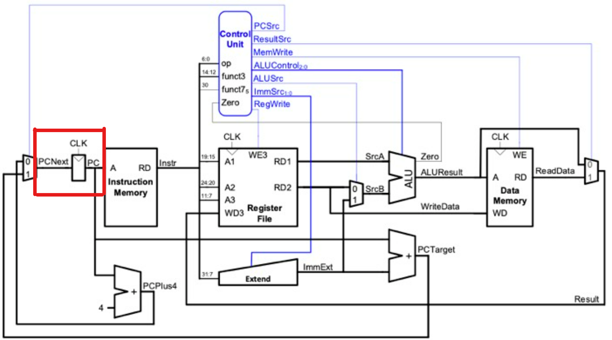
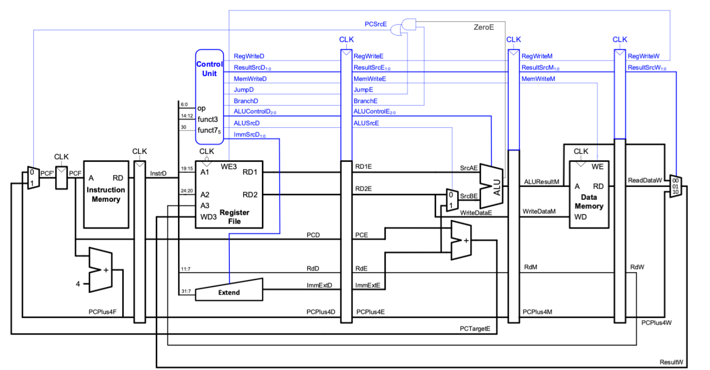

## RV32I Pipelined CPU Coursework
___
    
## Personal Statement of Contributions
___

**_Derin Ak_**

___

## Overview
* [PC Register](#PC-Register)
* [PC Next](#PC-Next)
* [Pipelining](#Pipelining)
    - [PC Next](#PC-Next)
    - [CPU](#CPU)
    - [Pipelining Hazards](#Pipelining-Hazards)
* [Reflections about the Project](#Reflections-about-the-Project)

___

### PC Register

[Link to module](https://github.com/EIE2-IAC-Labs/iac-riscv-cw-1/blob/main/CPU/PC_Register.sv)

I made the original version of the PC register for Lab 4 and this module did not need to be changed for the single-cycle CPU or the pipelined version.  It is simply just a register that outputs the PC on the positive edge of the clock.

  

There is no link for the relevant commit of this section because my teammate uploaded my module from Lab 4 to the single cycle CPU folder. 

___

### PC Next

[Link to module](https://github.com/EIE2-IAC-Labs/iac-riscv-cw-1/blob/main/CPU/PC_Next.sv)

I made the original version of the PC next file for Lab 4 which did not include the jump and link register instruction. It selected incremented PC (PC+4) when the PCsrc signal was 0 and selected PC+immext when the PCsrc signal was 1.  

  

There is no link for the relevant commit of this section because my teammate uploaded my module from Lab 4 to the single cycle CPU folder.

___

### Pipelining

#### CPU

[Link to module](https://github.com/EIE2-IAC-Labs/iac-riscv-cw-1/blob/pipelining/CPU/cpu.sv)

I added registers between the fetch, decode, execute, memory, and writeback stages and created necessary interconnecting wires. Keeping the pipelining registers in the CPU file made it easier for me to see how the wires were connected and follow different stages. I connected them as shown in the diagram below although some of the control unit signals are different from the diagram. I connected these signals that are different from the diagram according to the stage they were being used.  

  

I removed PCsrc and Zero signals from the Control Unit.  PCsrc signal is determined by the Zero signal coming from ALU which happens in execute stage and the Branch and Jump (Jlink in our module) signals coming from the control unit which happens in the decode stage. Therefore, Branch and Jump signals became the output signals of the Control Unit and were later combined with the Zero signal from ALU in the execute stage. The logic for PCsrc is not shown correctly in the diagram above. The logic used for PCsrc was:

    assign PCsrcE= branchE && !ZeroE || JlinkE;

Relevant Commit: [Added CPU for the pipelined version](https://github.com/EIE2-IAC-Labs/iac-riscv-cw-1/commit/2f3222e1021bb1d561a8fb759e1df01def2328f8)

---

#### PC Next

[Link to module](https://github.com/EIE2-IAC-Labs/iac-riscv-cw-1/blob/pipelining/CPU/PC_Next.sv)

The PC next file needed to be changed for pipelining because PC+4 was determined in the fetch stage whereas PC+immext or PCJALR signal for jump and link register instruction was determined in the execute stage. Although these signals came from different stages I wanted to keep them in a single PC next file because it was easier to follow. Therefore, I added a second PC input in the PC next file for the PC signal coming from the execute stage. Now, PC next module for pipelining contains incremented PC (PC+4) happening in the fetch stage, PC+immext, and JALR input happening in the execute stage combined in a file. 

  

Relevant Commit: [Added PC Next for pipelined version](https://github.com/EIE2-IAC-Labs/iac-riscv-cw-1/commit/bb5cf03f070a0b56bed9991aaabd8ca1abcdb3b5)

---

#### Pipelining Hazards

[Link to module](https://github.com/EIE2-IAC-Labs/iac-riscv-cw-1/blob/pipelining/src/myprog/f1.s)

In order to prevent pipeline hazards, I added nop instruction (addi zero, zero, 0) in the f1 program. 

Relevant Commit: [Added Nops](https://github.com/EIE2-IAC-Labs/iac-riscv-cw-1/commit/63de4b4d7d5f6b7ee30f89661105dfa00921bb3d)

___

### Reflections about the Project

In this project, I believe that implementing RISCV with System Verilog helped me to understand how a CPU works more thoroughly. Since I have been working on pipelining of the RISC-V, I also could comprehend the concept of pipelining better. While implementing and testing the pipelining, I went through and understood other parts of the project that I have not done as well in order to debug it. If I had more time, I would have liked to implement other instructions in the CPU to see how they work, add the multi-cycle integer multiply/divide instruction, and wishbone bus interface. 
