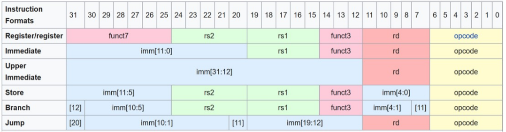

## RISC-V RV32I Processor Coursework

---
## Personal Statement of Contributions

**_Jacob Alexandrou_**

---

## Overview

* [Sign Extension Unit](#Sign-Extension-Unit)
* [Instruction Memory](#Instruction-Memory)
* [Jump Instructions](#Jump-Instructions)
* [Data Memory](#Data-Memory)
* [F1 Program](#F1-Program)
* [Reference Program](#Reference-Program)
    - [Features Added](#Features-Added)
    - [Testing](#Testing)
    - [Pipelining](#Pipelining)

___
### Sign Extension Unit
___

*[Link to module](https://github.com/EIE2-IAC-Labs/iac-riscv-cw-1/blob/54027ed4943bb47a50a4d34860ead019083ba575/CPU/SignExtend.sv)*

I made the sign extension unit for lab 4  and its structure did not need to be changed for the implementation of the full single cycle CPU. It is quite a simple module; only having to select bits from the input instruction and concatenate. This is done differently for each instruction type:

  

In the module, the type of instruction is determined by the ImmSrc control signal. I created an enum of for this:

    typedef enum bit[2:0]   {Imm, Store, Branch, Jump, UppImm}   Instr_type; 

Then I simply used a case statement and defined the correct bit selection for each instruction type.

___
### Instruction Memory
___

**Relevant commits:** [Added InstrMem](https://github.com/EIE2-IAC-Labs/iac-riscv-cw-1/commit/5434e33336bea65689f02cd584aff006a00d3589)

___
### Jump Instructions
___
___
### Data Memory
___
___
### F1 Program
___
___
### Reference Program
___

#### Features Added

#### Testing

#### Pipelining