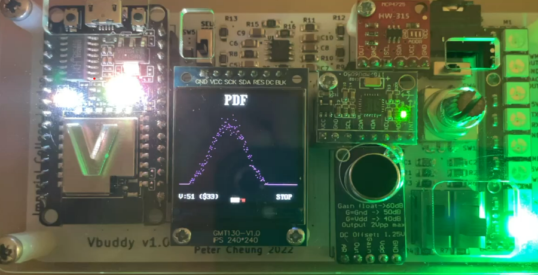

<center>

## RISC-V RV32I Processor Coursework

---
## Personal Statement of Contributions

**_Jacob Alexandrou_**

---

</center>

## Overview

* [Sign Extension Unit](#Sign-Extension-Unit)
* [Instruction Memory](#Instruction-Memory)
* [Data Memory](#Data-Memory)
* [Jump Instructions](#Jump-Instructions)
* [F1 Program](#F1-Program)
    - [SLLI Instruction](#SLLI-Instruction)
    - [Program](#Program)
* [Reference Program](#Reference-Program)
    - [Features Added](#Features-Added)
    - [Testing](#Testing)
    - [Pipelining](#Pipelining)
    - [Results](#Results)
* [Additional Comments](#Additional-Comments)

___
### Sign Extension Unit
___

*[Link to module](https://github.com/EIE2-IAC-Labs/iac-riscv-cw-1/blob/54027ed4943bb47a50a4d34860ead019083ba575/CPU/SignExtend.sv)*

I made the sign extension unit for lab 4  and its structure did not need to be changed for the implementation of the full single cycle CPU. It is quite a simple module; only having to select bits from the input instruction and concatenate. This is done differently for each instruction type:

<p align="center">  </p>

In the module, the type of instruction is determined by the ImmSrc control signal. I chose to set the value of ImmSrc for each instruction type like so:

<center>

| ImmSrc  | Instruction type |
| ------------- | ------------- |
| 000  | Immediate  |
| 001  | Store  |
| 010  | Branch |
| 011  | Jump |
| 100  | Upper Immediate  |

</center>

and then created an enum for this in the code:

    typedef enum bit[2:0]   {Imm, Store, Branch, Jump, UppImm}   Instr_type; 

Then I simply used a case statement and defined the correct bit selection for each instruction type.

___
### Instruction Memory
___

**_Relevant commits:_** 
* [Added InstrMem](https://github.com/EIE2-IAC-Labs/iac-riscv-cw-1/commit/5434e33336bea65689f02cd584aff006a00d3589)

The instruction memory is a ROM with a 32-bit input and output. It takes the program counter as input and outputs the corresponding instruction.

There are a few design decisions to note here:

Firstly, the address used for the instruction in the ROM is the program counter shifted right by 2 bits:

        instr = rom_array[{2'b0, PC[31:2]}]; 

This is to account for the byte offset and the fact that the PC increments by 4.

Secondly, instruction hex code was provided to us as 8-bit(byte) data. Although it may not reflect how a real RISC-V processor functions; for simplicity, and due to the fact that there is no need to select individual bytes of the instructions in this coursework, I decided to store instructions in the ROM as 32-bit words.

To help with this I modified the `format_hex.sh` shell script provided by changing the line:

    od -v -An -t x1 "$1.bin" | tr -s '\n' | awk '{$1=$1};1' > "$1.hex"
 to :

    od -v -An -t x4 "$1.bin" | awk '{$1=$1};1' > "$1.hex"

This meant the script would output 32-bit big-endian data instead of 8-bit little-endian data so I could load the output hex files straight into the instruction memory.

___
### Data Memory
___

**_Relevant commits:_** 
* [Added DataMem](https://github.com/EIE2-IAC-Labs/iac-riscv-cw-1/commit/b89896eea99621c5557e894e96ed3fe092693274)
* [Updated cpu.sv to include data memory](https://github.com/EIE2-IAC-Labs/iac-riscv-cw-1/commit/84e6cd3523cdc1fac9612c16d6d25a7571a449b0)
* [Modified data memory and control signals for byte addressing](https://github.com/EIE2-IAC-Labs/iac-riscv-cw-1/commit/c5528319f45ad3dd552e73f9799e3639bf0602c5)
* [Corrected DataMem](https://github.com/EIE2-IAC-Labs/iac-riscv-cw-1/commit/8a508d4fcfeee2a32b64aa3787a57578072ec95a)

When I first added data memory to the CPU I created a memory file very similar to the instruction memory, except it was a RAM instead of ROM and it was possible to write to the memory when the write enable (we) control signal was high. This was capable of running the load and store word instructions.

Later on in the design process when the load and store byte instructions were required I heavily modified the design. I will discuss this up-to-date version.

The first change I made to the memory was to change the data size in the ROM to 8-bit, therefore meaning that individual bytes could be easily accessed and stored when using the input address directly.

See the code for reading and writing bytes below:

Writing:

```verilog 
    else if (we && ByteOp) begin
        ram_array[Address] <= WriteData[7:0];
    end 
```
Reading:

```verilog
    if (ByteOp) begin
            ReadData = {24'b0, ram_array[Address]};
    end
```
**Note:** For writing bytes to memory we always select the bottom 8-bits of the write data since the store byte instruction always stores the least significant byte in the register to memory.

You will notice in both the code snippets that the boolean `ByteOp` is present. This is a control signal I added to distinguish between word and byte operations in the memory. `ByteOp` is set to high for the byte instructions including `SB` and `LBU` and is low for all others.

The final feature of the memory to note is how words are written and stored following the restructure. This can be seen clearly from the code:

Writing:

```verilog
    always_ff @(posedge clk) begin
        if (we && !ByteOp) begin                 
            ram_array[{Address[31:2], 2'b0}]   <= WriteData[31:24];       // Big endian storage  
            ram_array[{Address[31:2], 2'b0}+1] <= WriteData[23:16];
            ram_array[{Address[31:2], 2'b0}+2] <= WriteData[15:8];
            ram_array[{Address[31:2], 2'b0}+3] <= WriteData[7:0];
        end
``` 
When writing the input address is taken and the bottom two bits are replaced with zeros to ensure we have the base word address. Following this, bytes are selected from the `WriteData` from most significant to least and are stored in the base word address and the next 3 higher addresses respectively. This means the word is stored in memory in the big-endian format.

Reading:

```verilog
    ReadData = {ram_array[{Address[31:2], 2'b0}], 
                ram_array[{Address[31:2], 2'b0}+1], 
                ram_array[{Address[31:2], 2'b0}+2], 
                ram_array[{Address[31:2], 2'b0}+3]};
```
Reading works in a similar way; we start by reading the byte in the base word address, then concatenate this with the bytes in the next 3 higher addresses. The output `ReadData` is then the required full 32-bit word.
___
### Jump Instructions
___

**_Relevant commits:_** 
* [Added control signals and logic for JAL and JALR](https://github.com/EIE2-IAC-Labs/iac-riscv-cw-1/commit/c7f90b038431a2868a718ab96a4e37b59cab5620)
* [Created test program jumps.s and fixed errors in CPU](https://github.com/EIE2-IAC-Labs/iac-riscv-cw-1/commit/5f0a7563d39e276319d26a059350cd76f1d95523)

In order to implement the two jump instructions, `JAL` and `JALR`, I had to add a few features to the CPU:


1. Calculate the program counter values for each jump instruction correctly.
2. Add control logic to select the next value of the program counter for the `JAL` and `JALR` instructions and integrate this with branch instructions.
3. Add an output and control logic to store `PC+4` in the register file when a jump instruction occurs.

To calculate the program counter value for `JAL` I had to ensure that the control signal `ImmSrc` was set to `3'b011` in order to select and sign extend the correct 20-bit immediate for the J-type instruction. This immediate could then be added to the program counter in the same way as for branch instructions.

`JALR` is different in the sense that the program counter value comes from the ALU output. The instruction uses the regular I-type extension and the immediate is added to the `RD1` output of the register file.

I designed the logic to select the next program counter value as two cascading multiplexers: 

<p align="center">  </p>

_(These were added as code in the `PC_Next.sv` module)_

As above, two control signals are use to select `PC_Next`:

`PcSrcReg` is a new control signal I added that is only high for the `JALR` instruction.

`PcSrc` was the existing control signal used for branch instructions and also needs to be high for the `JAL` instruction. I implemented the following logic in the `ALUDecoder.sv` module for this:

```verilog
    always_comb begin
        casez({Jlink, func3})
            4'b1???: PCSrc_o = 1;
            4'b0001: begin   // for bne, branch if alu output not zero
                if(branch && !zero) begin 
                    PCSrc_o = 1; 
                end                
            end
            default: PCSrc_o = 0;
        endcase
    end
```
By using a casez statement I could include don't-cares in the case statement which is what the `?` are. `Jlink` is high only for the `JAL` instruction and when this is the case, `PCSrc` is always high. I have only included logic for the `BNE` branch instruction above; however the design is made to be easily scalable for the other branch instructions by including different values of `func3` in the case statement and adding logic for them. 

The last step to fully implement the jump instructions was adding the ability to write `PC+4` to the register file. 

To do this I firstly had to add another output to the `PC_Next` component which always output the value of the current program counter plus 4. 

I then created another cascading multiplexer at the write data input of the register file. The code implementation of this can be seen here:

```verilog
    .wd3 (StorePC ? PC_Plus4 : (ResultSrc ? ReadData : ALUout)),
```
When the control signal `StorePC` is high, which is only when there is a `JAL` or `JALR` instruction, `PC+4` is written to the RegFile. In all other instructions, the write data is dependent on the `ResultSrc` control signal, selecting better then ALU or data memory output.

At this point, the jump instruction were fully implemented so I wrote a quick test program called `jumps.s` which featured a subroutine and used this to debug and confirm correct functionality.

Link to program **[here](https://github.com/EIE2-IAC-Labs/iac-riscv-cw-1/blob/35b963d53edd7f8b925cd79fa52b680a9464c8ad/src/myprog/Jumps.s)**.
___
### F1 Program
___

**_Relevant commits:_** 
* [Added left shift to ALU](https://github.com/EIE2-IAC-Labs/iac-riscv-cw-1/commit/194f6e81f202ff305ce9d08535dba87b6cc066b0)
* [Updated control unit to include slli instruction](https://github.com/EIE2-IAC-Labs/iac-riscv-cw-1/commit/e6a7746c1ae94fe2af1527dc1e33c058646ea52e)
* [Created and tested simple f1 program](https://github.com/EIE2-IAC-Labs/iac-riscv-cw-1/commit/7d13dc531af121c6103cdfe3964bde80c30fd72a)
* [Corrected simple f1 program](https://github.com/EIE2-IAC-Labs/iac-riscv-cw-1/commit/bed8897bd3a7b0a4d894cca0ce007a8e5ae4f5f0)
* [Modified f1.s to run on pipelined CPU](https://github.com/EIE2-IAC-Labs/iac-riscv-cw-1/commit/cd04bde3ae12fc08b2df848dae1a01bbd9a26168)

#### SLLI Instruction

Before creating and testing an f1 starting light program I knew I would need to implement the shift left logical immediate instruction (SLLI) instruction. This can be used to shift the contents a register left by a number of bits specified in the immediate.

The implementation was quite simple; firstly adding a new ALU function which would shift `ALUop1` by `ALUop2`:

```verilog
    LSHIFT: ALUout = ALUop1 << ALUop2;
```
Then adding some control unit logic to set the correct value of the `ALUctrl` signal which can be seen in this [commit](https://github.com/EIE2-IAC-Labs/iac-riscv-cw-1/commit/e6a7746c1ae94fe2af1527dc1e33c058646ea52e)

#### Program

At this point, all the instructions required for f1 program were implemented so I wrote a simple version which after some fixes looked like this:

```assembly
.text
main:
    jal     ra, init           # execute init subroutine
loop:
    jal     ra, reset          # execute reset subroutine
    jal     ra, shift          # execute shift subroutine
    j       loop               # loop forever
init:
    addi    t1, zero, 0xFF     # load t1 with 255
    ret
reset:
    addi    a0, zero, 0x0      # a0 used for output
    addi    a1, zero, 0x1      # set a1 to 1
    ret
shift:
    addi    a0, a1, 0          # load a0 with a1 
    slli    a1, a1, 1          # shift a1 left by 1 bit
    addi    a1, a1, 1          # increment a1 by 1
    bne     a1, t1, shift      # if a1 !=255, branch to shift
    addi    a0, a1, 0          # load a0 with a1 
    ret             
```
I also made a simple testbench to produce a `.vcd` waveform output but did not include any Vbuddy functionality. When testing the program initially it was not functioning as intended and after examining the waveform I realised I had somehow made it this far without making register x0 unwritable.

This was a quick fix, with line 19 of `RegFile.sv` being changed to:

```verilog
if (we3 && ad3 !==0)
```
Now the register would not write if the write address was zero.

After this fix, the program worked well, and I handed over to my teammate James to modify the program and add a testbench for Vbuddy.

I also modified my program with `NOP` instructions to test if it would run on the pipelined CPU.
___
### Reference Program
___

**_Relevant commits:_** 
* [Added control signals for lui](https://github.com/EIE2-IAC-Labs/iac-riscv-cw-1/commit/4e4a2d0ae48c0716f1e55d7d363ada0d5b0c4d67)
* [Updated ALU for lui instruction](https://github.com/EIE2-IAC-Labs/iac-riscv-cw-1/commit/36cb8954ad44e872c26a166f0ca0b78b43921a34)
* [Fixed Rtype control signals](https://github.com/EIE2-IAC-Labs/iac-riscv-cw-1/commit/0737ed294551ec203059c6ee195127004d3a9602)
* [Updated pdf testbench so pdf.s now runs](https://github.com/EIE2-IAC-Labs/iac-riscv-cw-1/commit/256b682a6b66d696ac34053d94da9146b903d1ba)
* [Made testbench to run reference program on Vbuddy](https://github.com/EIE2-IAC-Labs/iac-riscv-cw-1/commit/5ac570ef7df0a8912304a4a68aba38c7fd04cf4f)
* [Tested reference program on pipelined CPU](https://github.com/EIE2-IAC-Labs/iac-riscv-cw-1/commit/ba17492d2c87faa9a6d64ffcedf5ca61d159924c)
* [Modified testbench so reference program runs on vbuddy](https://github.com/EIE2-IAC-Labs/iac-riscv-cw-1/commit/653e1e8afee4d421652a3e71d2b778744df45ac9)

#### Features Added

When provided with the reference program I created a simple testbench and tried running it on our CPU. Unfortunately the output pdf waveform was not produced. The first error I noticed was that I has not yet implemented the `LUI` instruction required for some executions of the `LI` pseudo instruction. 

To implement this I had to add logic inside the control unit to set the value of `ALUctrl` to a new value (6) for the `LUI` instruction. I then created a new function in `ALU.sv` corresponding to this value of `ALUctrl` called `PASSOP2` which simply passed through `ALUop2` to the output. This could be used with the sign extension for U-type instructions to execute the `LUI` instruction successfully.

The second bug I found during debugging was with the `MemWrite` control signal for R-type instructions. It was set to high and needed to be low.

#### Testing

Due to the fact the program took ~150,000 clock cycles to execute, this could not all be run on Vbuddy. I therefore created a testbench that would only plot the output data on Vbuddy once the `display:` subroutine was executed in the program.

I did this by firstly adding a new line to the reference program in `loop3:` just before the value of a0 is set to one of the pdf values:

```assembly
LI      a0, -1              #   a0 = -1, this is used to control a bool in the tesbench
```
As per the comment, I used this to control a boolean in the testbench called `StoreNextVal`. This boolean is set to high when `a0 == -1` and it tells me that in the next clock cycle, the value of a0 will be one of the pdf values. I could then use this to store all the pdf values in an array, and output them later to command line and to Vbuddy.

The code for storing the values looks like this:

```c++
    if (StoreNextVal) {
            if (ValuesStored <= 255) {
              Pdf_Values[ValuesStored] = top->a0;
              ValuesStored++;
              StoreNextVal = 0;
            } 
            else break;
        }
```
Notice `StoreNextVal` is set back to zero every time a pdf value is stored.
The size of the array is also limited to 255 as this is the number of pdf values the program produces.

The output section of the testbench is as follows:

```c++
for (int i = 1; i <= 240; i++){    //limit to 240 here since this is the resolution of vbuddy display in x direction            
      std::cout << "X: " << i << " Y: " << Pdf_Values[i] << std::endl;
      vbdPlot(Pdf_Values[i], 10, 190);  //Scaled the display slighty so the top and bottom values can be seen more clearly
    }
```
The values stored in the array are simply output to Vbuddy, resulting in very fast execution of the program.
#### Pipelining

For the pipelined CPU I added many `NOP` instructions to the reference program to avoid hazards. This meant that the program now took roughly 3 times as many clock cycles to run.

In addition to this the testbench had to be modified slightly so that the program would run correctly on Vbuddy.

Since there were now two `NOP` instruction between the cycle the `StoreNextVal` boolean was set and the moment `a0` was set to the pdf value, `a0 = -1` was stored to the array twice before the desired value of a0. In hindsight I should have altered this but instead I increased the size of the array by 3 times and added to the output section:

```c++
    if(Pdf_Values[i] != -1)
```
So the value would only be output to Vbuddy if it was not equal to -1.
#### Results

Here are examples of Vbuddy displaying the result graphs:

Gaussian:
<p align="center">  </p>

Noisy:
<p align="center">  </p>

Triangle:
<p align="center">  </p>

Sine:
<p align="center">  </p>

___
### Additional Comments
___

In addition to the contributions listed above, I also did some general bug fixing and verification of the CPU. For example:

* [Updated CPU so addi, bne and lw instructions are fully working](https://github.com/EIE2-IAC-Labs/iac-riscv-cw-1/commit/6086ff9674b36455e1ecf331ca8581812c731c0c)
* [Verified basic counter program runs on pipelined CPU](https://github.com/EIE2-IAC-Labs/iac-riscv-cw-1/commit/a2f5b9865beaa997364e98eaa9f65884187b0cea)

To conclude, I enjoyed the time I spent working on the project and I feel satisfied that I learnt a good amount about RISC-V, SystemVerilog and about hardware design in general. I would have liked to have worked on the data cache and possibly other features if there was more time; perhaps I will revisit these in the future. One thing I would do differently if I had the chance is to take the time to properly plan the changes I made at the beginning of the project, because when I started doing this for later changes I found I was more successful, spent less time debugging and it made the whole process more efficient and enjoyable. 
