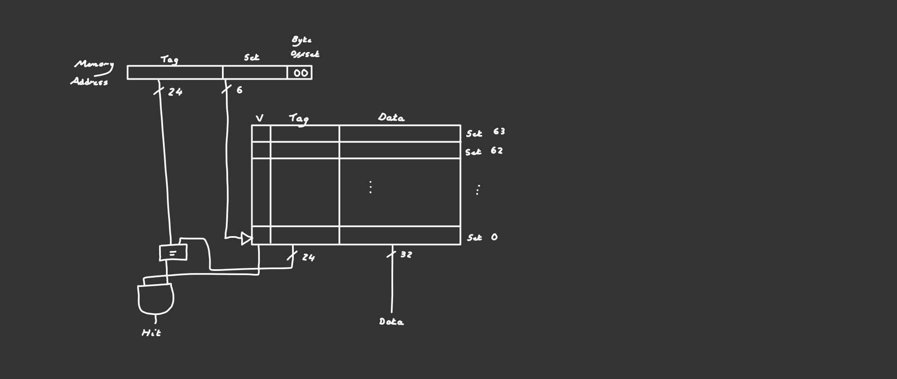

<center>

## RV32I Pipelined CPU Coursework

 **Personal Statement of Contributions**
 
 *Jacob Peake*

---

</center>

## Overview

* [ALU](#ALU)
* [Data Memory](#Data-Memory)
* [Register File](#Register-File)
* [CPU](#CPU)
* [Cache](#Cache)
___
### ALU
___

*[Link to module](https://github.com/EIE2-IAC-Labs/iac-riscv-cw-1/blob/main/CPU/ALU.sv)*
___
### Data Memory
___

*[Link to module](https://github.com/EIE2-IAC-Labs/iac-riscv-cw-1/blob/main/CPU/DataMem.sv)*
___
### Register File
___

*[Link to module](https://github.com/EIE2-IAC-Labs/iac-riscv-cw-1/blob/main/CPU/RegFile.sv)*
___
### CPU
___

*[Link to module](https://github.com/EIE2-IAC-Labs/iac-riscv-cw-1/blob/main/CPU/cpu.sv)*

___
### Cache
___

*[Link to module](https://github.com/EIE2-IAC-Labs/iac-riscv-cw-1/blob/cache/CPU/DataMem.sv)*

The additional stretch goal of this project was to add Data Memory Cache to the pipelined processor. Even though this may negatively impact performance in the case of our processor, due to it already being single-cycle memory which is very fast, implementing this into the CPU taught me further details about how cache memory works and the challenges that can occur when implementing it into a real design.

In my design I have used direct mapped cache as it is simple to implement into the existing processor- and only requires a small amount of extra hardware which can be put inside the Data Memory module itself. As the limit given by the stretch goal is 256 bytes of data cache- I had to implement the cache as having a capacity of 64 words, with a width of 57 bits, 32 for the data, 24 for the tag and 1 for the V bit.

This allowed me to define a one dimensional cache array with 64 sets:

`logic [CACHE_WIDTH-1:0] cache_array [2**SET_WIDTH-1:0];`

When reading data from memory, the cache should be checked first, before checking the data memory itself. To implement this is SV, we use an if statement to compare value in Cache with the corresponding Tag of the address- and check if the V bit is 1. If true, read data from Cache, otherwise go to the data memory address to read data and also copy that data into cache.

```
if((cache_array[55:32] == Address [31:8]) && cache_array[56] == 1) begin    // Check cache first
    ReadData = cache_array[Address[8:2]];
end
else begin
    ReadData = ram_array[Address];
                
    cache_array[Address[8:2]] <= ram_array[Address];    // Put Accessed Data into Cache, Temporal Locality
 end
```

A problem is encountered is when writing data to cache memory. If cache misses, the cache block is fetched from main memory and the word is written to the cache block. If cache hits, the word is simply written to the cache block. Once a word is written, the cache contains different data from the main memory (cache coherency). To solve this, I implemented the cache as write through- so that data is written to cache and the main memory simultaneously. Whenever write enable is 1- any data written to main memory is also written to the corresponding set in cache.

Here is a diagram of the direct-mapped 256-byte cache:

<p align="center">  </p>

If I had more time, I would have implemented set associative cache which is designed to take advantage of spatial locality in order to reduce the miss rate as much as possible. I also would have liked to expand the memory heirarchy to multiple levels of cache.         
___

